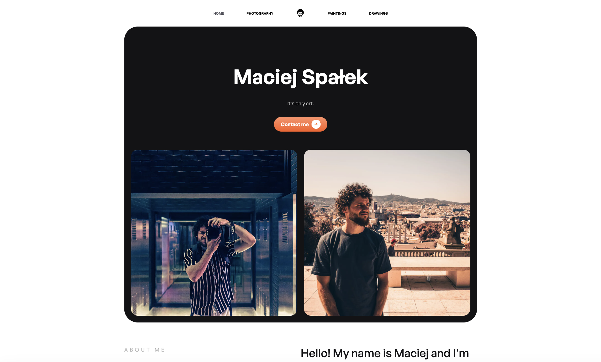
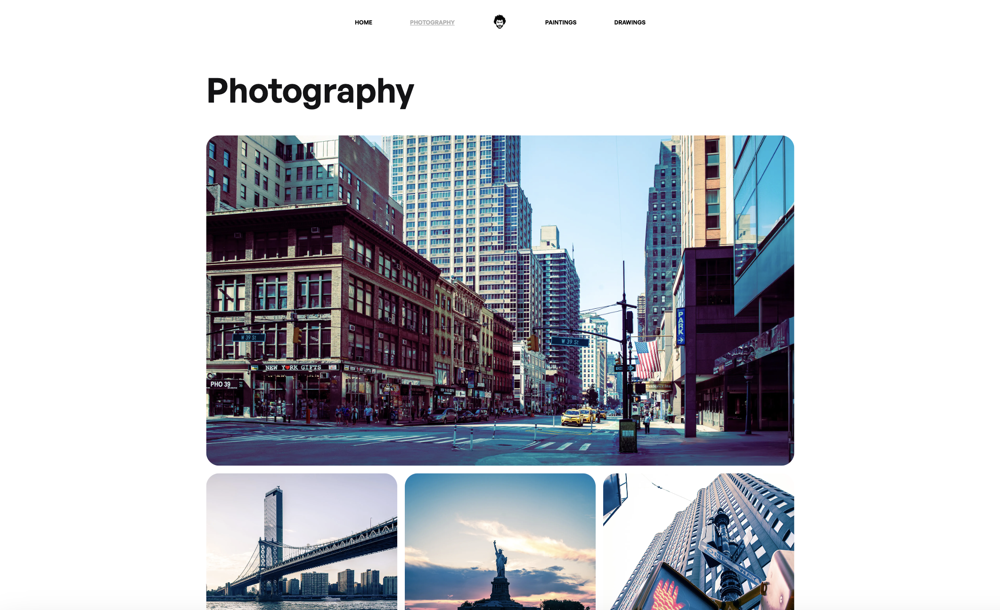
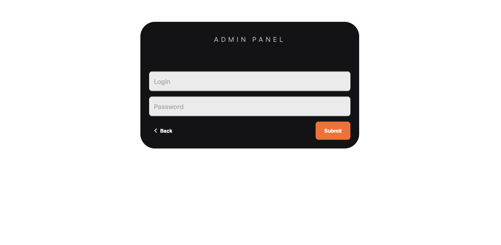
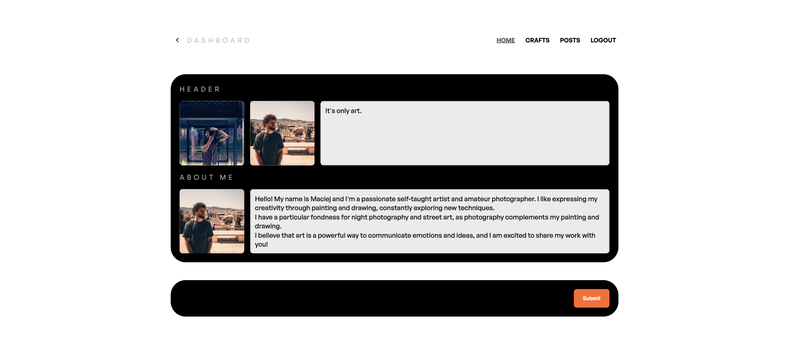
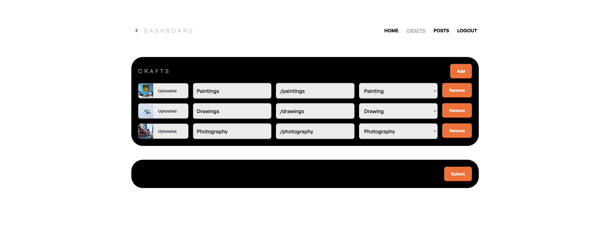
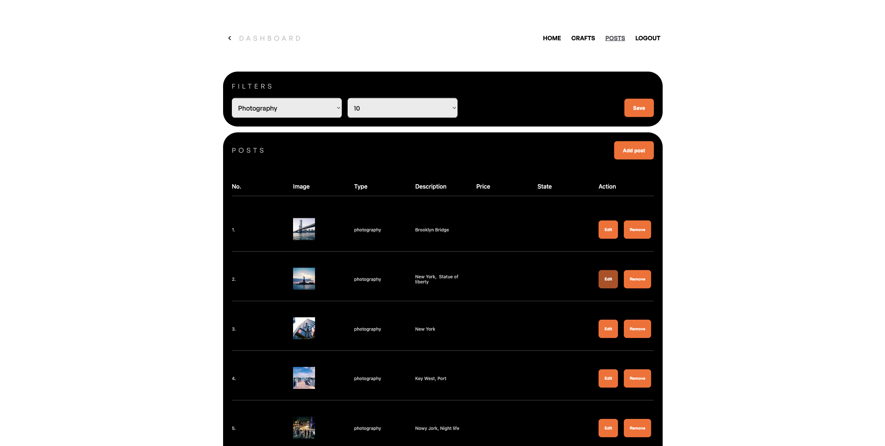

# Maciej Spałek - Art portfolio

## Live

<https://www.mspalek.pl>

## Description

This website is my art portfolio, I show here my paintings, drawings and photographs. For content manipulation I created administrator panel.

## Screenshots

&nbsp;

&nbsp;

&nbsp;

&nbsp;

&nbsp;

## Tech/framework used

| Tech                       | Description                                                                                       |
| -------------------------- | ------------------------------------------------------------------------------------------------- |
| Next.js                    | The React Framework for the Web.                                                                  |
| TypeScript                 | A language for application-scale JavaScript.                                                      |
| Tanstack / React Query     | Missing data-fetching library for web applications                                                |
| Styled Components          | A React package to manage styles in applications                                                  |
| Axios                      | It's a Javascript library used to make HTTP requests from node.js                                 |
| React-hook-form            | Library to build forms                                                                            |
| GSAP                       | Framework-agnostic JavaScript animation library                                                   |
| Jest/React testing library | Tool for Unit tests                                                                                        |
| Cypress                    | Tool for e2e tests |

&nbsp;

## Backend repository

<https://github.com/MaciejSpalek/maciejspalek-backend>
